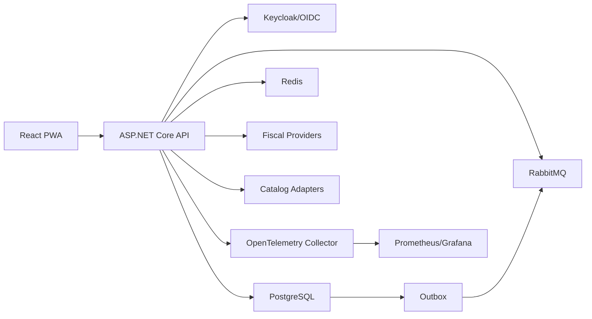

# Arquitetura

## Visao Geral

Atlas ERP e um modular monolith com fronteiras explicitas por bounded context. O deploy inicial e unico, mas cada modulo tem schema, namespace, endpoints e contratos proprios. Essa escolha privilegia consistencia transacional no core e deixa o sistema pronto para futura extracao de servicos.

## Camadas

- `Common`: entidades base, tenant, eventos, policies.
- `Infrastructure`: EF Core, outbox, migrations, interceptor de tenant.
- Modulos: administracao, identidade, catalogo, compras, estoque, vendas, fiscal, financeiro, CRM, relatorios e integracoes.
- `Program.cs`: composicao, DI, auth, swagger, observabilidade e middlewares.

## Bounded Contexts

| Contexto | Schema | Responsabilidade |
| --- | --- | --- |
| Administracao | `administration` | empresas, filiais e parametros globais |
| Identidade | `identity` | perfis, roles e permissoes |
| Catalogo | `catalog` | produto tecnico e compatibilidade |
| Compras | `purchasing` | fornecedores e pedidos |
| Estoque | `inventory` | saldos, reservas, movimentos e picking |
| Vendas | `sales` | orcamento, pedido, balcao e caixa |
| Fiscal | `fiscal` | regras, DF-e, XML e eventos |
| Financeiro | `finance` | pagar, receber, caixa e conciliacao |
| CRM | `crm` | clientes e interacoes |
| Integracoes | `integrations` | adapters e outbox |
| Auditoria | `audit` | before/after de alteracoes |

## DDD

Agregados com regra de negocio:

- `AutoPartProduct`: normalizacao, aplicacoes, equivalentes e historico de preco.
- `PurchaseOrder`: status e aprovacao.
- `StockMovement`: movimento auditavel.
- `SalesOrder`: snapshots, recalculo, aprovacao, devolucao e garantia.
- `FiscalDocument`: ciclo fiscal, protocolos, XML e eventos.
- `AccountPayable` e `AccountReceivable`: titulos financeiros.

Eventos de dominio:

- `ProductCreated`;
- `ProductCompatibilityChanged`;
- `ProductPriceChanged`;
- `PurchaseOrderCreated`;
- `PurchaseOrderApproved`;
- `StockMoved`;
- `SalesOrderCreated`;
- `SalesOrderApproved`;
- `SalesReturnRegistered`;
- `FiscalDocumentCreated`;
- `FiscalDocumentAuthorizationChanged`.

## CQRS

O sistema usa CQRS de forma pragmatica:

- comandos alteram agregados por servicos de aplicacao;
- leituras retornam DTOs especificos;
- dashboards usam queries de leitura isoladas;
- busca de catalogo tem servico proprio.

Nao ha mediador global. O objetivo e manter simplicidade e separar leitura/escrita onde ha ganho real.

## Outbox

`AtlasDbContext.SaveChangesAsync`:

1. aplica tenant, usuario e timestamps;
2. coleta auditoria;
3. coleta domain events;
4. cria mensagens em `integrations.outbox_messages`;
5. salva tudo na mesma transacao.

`OutboxDispatcher` publica no RabbitMQ com retries.

## Tenant e RLS

`TenantSessionInterceptor` configura variaveis de sessao PostgreSQL:

- `atlas.company_id`;
- `atlas.branch_id`;
- `atlas.user_id`.

As policies de RLS usam essas variaveis para isolar dados por empresa. Consultas tambem filtram por tenant no EF para defesa em profundidade.

## Fronteiras para Extracao Futura

Modulos candidatos a servicos:

- Fiscal: alto acoplamento externo e carga assincrona.
- Integracoes: adapters de catalogo e webhooks.
- Relatorios: leitura analitica por replica/logical replication.
- Estoque: se houver alto volume de WMS.

Ao extrair, preservar:

- contratos de API;
- eventos de integracao;
- ownership de schema;
- ids como UUID/string;
- outbox ou inbox por servico.
