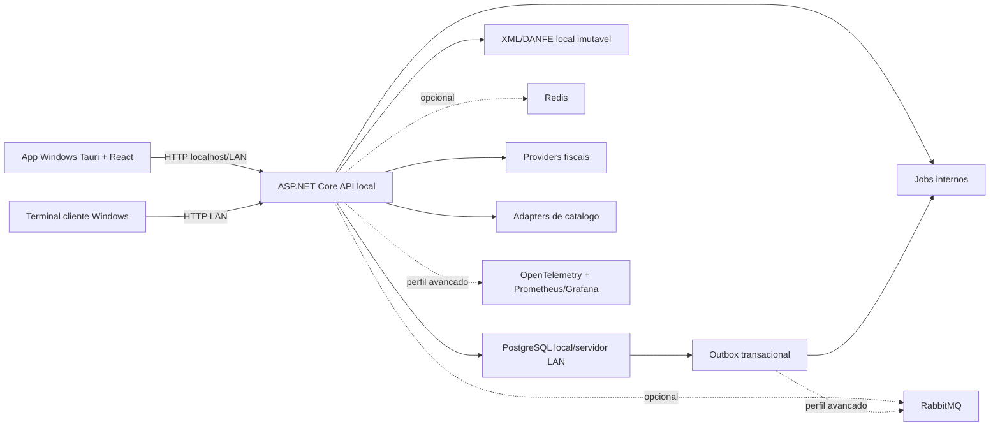

# Arquitetura

## Visao Geral

AutoParts ERP Desktop e um modular monolith local-first. A interface roda como aplicativo Windows com Tauri, reaproveitando React/TypeScript. A API ASP.NET Core continua separada e roda como processo/servico local no servidor da loja ou em uma maquina de rede. PostgreSQL e a fonte primaria de verdade. Redis, RabbitMQ e observabilidade completa entram por perfil avancado, sem serem obrigatorios para uma instalacao pequena.

## Perfis de Execucao

| Perfil | Componentes | Uso |
| --- | --- | --- |
| Simples | Desktop, API local, PostgreSQL, jobs internos | loja pequena ou servidor unico |
| Avancado | Desktop, API local/LAN, PostgreSQL, Redis, RabbitMQ, workers/observabilidade | rede com maior volume e integracoes |
| Desenvolvimento/Homologacao | Docker Compose, Postgres, Redis/Rabbit opcionais, API, desktop dev | testes tecnicos e homologacao |

## Camadas

- `src/desktop/AutoPartsErp.Desktop`: shell desktop, UI ERP, login local, status de servicos, consumo da API local.
- `src/backend/AutoPartsErp.Api`: composicao da API, Minimal APIs, Swagger, auth local, health checks.
- `Common`: entidades base, tenant, eventos, policies.
- `Infrastructure`: EF Core, migrations, outbox, auditoria e sessao PostgreSQL.
- Modulos: administracao, identidade, catalogo, compras, estoque, vendas, fiscal, financeiro, CRM, relatorios e integracoes.
- `database/migrations`: schema relacional, RLS, indices, particoes iniciais e seeds.
- `deploy/local`: exemplos para servidor Windows, firewall e servico local.

## Bounded Contexts

| Contexto | Schema | Responsabilidade |
| --- | --- | --- |
| Administracao | `administration` | empresas, filiais, parametros locais e setup |
| Identidade | `identity` | usuarios locais, roles, permissoes, sessoes e logs de auth |
| Catalogo | `catalog` | produto tecnico, OE, equivalentes, kits e compatibilidade |
| Compras | `purchasing` | fornecedores, pedidos, recebimento e XML de entrada |
| Estoque | `inventory` | saldos, reservas, movimentos, picking e transferencias |
| Vendas | `sales` | orcamento, pedido, balcao, devolucao, caixa e comissao |
| Fiscal | `fiscal` | regras, documentos, XML, eventos, protocolos e providers |
| Financeiro | `finance` | pagar, receber, caixa, conciliacao e centros de custo |
| CRM | `crm` | clientes, frota e historico |
| Integracoes | `integrations` | adapters, outbox e jobs |
| Auditoria | `audit` | before/after de alteracoes criticas |

## DDD, CQRS e Eventos

DDD e aplicado nos agregados com regra real: produto tecnico, pedido de compra, movimento de estoque, venda, documento fiscal e titulos financeiros. CQRS e usado pragmaticamente: comandos alteram agregados por services de aplicacao; queries retornam DTOs de leitura para busca de balcao, dashboards e relatorios operacionais.

`SaveChangesAsync` coleta auditoria, domain events e mensagens de outbox na mesma transacao. Em perfil simples, `LocalOutboxPublisher` marca o evento processado e permite jobs internos. Em perfil avancado, `RabbitMqOutboxPublisher` publica o envelope no RabbitMQ.

## Local Desktop

O desktop nunca e fonte oficial de dados. Ele guarda apenas sessao segura e preferencias locais. Dados oficiais ficam na API/PostgreSQL. A URL do servidor pode apontar para `localhost` no modo servidor local ou para IP/hostname da loja no modo terminal cliente.

## Fronteiras para Futuro

Os modulos fiscal, integracoes, relatorios e estoque continuam com fronteiras que permitem extracao futura. Essa extracao nao e obrigatoria para o produto local, mas contratos de API, eventos e schemas ja evitam acoplamento direto entre contexts.
